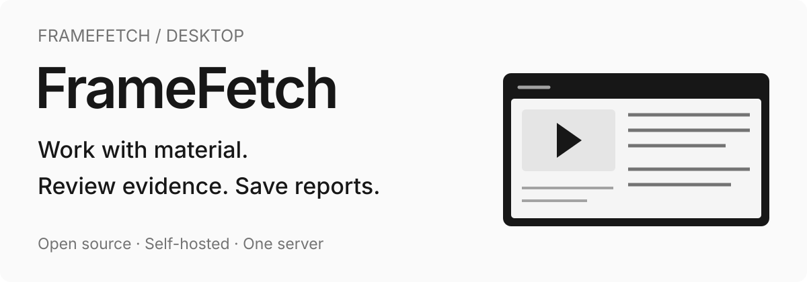
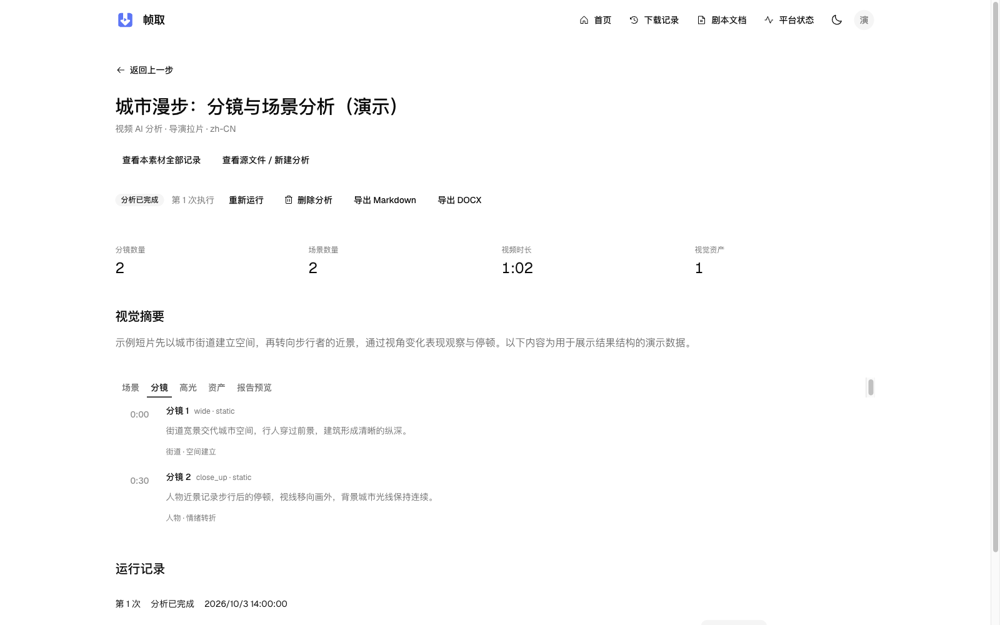

<p align="center">
  
</p>

#  FrameFetch Desktop

**The independent desktop client for your FrameFetch workstation.** Work with video and documents, inspect analysis evidence, and save files and reports through system dialogs. Bundled React pages connect to your FrameFetch Server.

[](https://github.com/StephenQiu30/video-electron/actions/workflows/internal-build.yml)
[](LICENSE)
[](https://github.com/StephenQiu30/video-electron/releases)

[Getting started](#getting-started) · [Features](#features) · [Development](#development-and-builds) · [Scope](#scope) · [Server / Web](https://github.com/StephenQiu30/video-server) · [App](https://github.com/StephenQiu30/video-app) · [简体中文](README.md)



> Captured from the released FrameFetch Desktop 0.2.0 Electron Renderer. These historical screens and demo data are not acceptance evidence for the current built-in Skill scope.

## Why use FrameFetch Desktop?

Use the Web business pages in a dedicated native window. The installer includes React pages and resources; API and job updates connect directly to your Server. Media processing, storage and AI execution run on the Server and host AI Worker.

- **Work at your desk**: review video, documents and long reports with the shared Web layout.
- **Save through the system**: use native file selection, save dialogs, menus and window controls.
- **Continue across clients**: sign in to the same Server to access existing material, jobs and reports.

## Getting started

### Download the public preview

The current public release is **[v0.2.0-beta.1](https://github.com/StephenQiu30/video-electron/releases/tag/v0.2.0-beta.1)**. The package version and filenames remain `0.2.0`; the tag's `beta.1` identifies the public preview channel.

| System                             | Download                                                                                                                                        |
| ---------------------------------- | ----------------------------------------------------------------------------------------------------------------------------------------------- |
| macOS 14.0+, Apple Silicon (ARM64) | [FrameFetch-0.2.0-mac-arm64.dmg](https://github.com/StephenQiu30/video-electron/releases/download/v0.2.0-beta.1/FrameFetch-0.2.0-mac-arm64.dmg) |
| Windows x64                        | [FrameFetch-0.2.0-win-x64.exe](https://github.com/StephenQiu30/video-electron/releases/download/v0.2.0-beta.1/FrameFetch-0.2.0-win-x64.exe)     |
| SHA-256 checksum manifest          | [SHA256SUMS.txt](https://github.com/StephenQiu30/video-electron/releases/download/v0.2.0-beta.1/SHA256SUMS.txt)                                 |

Installers are unsigned and the macOS build is not notarized, so system security prompts may appear. No Intel macOS or Linux installer is currently provided. Calculate the downloaded file's SHA-256 and compare it with the manifest:

```sh
# macOS
shasum -a 256 FrameFetch-0.2.0-mac-arm64.dmg
```

```powershell
# Windows PowerShell
Get-FileHash .\FrameFetch-0.2.0-win-x64.exe -Algorithm SHA256
```

### Connect to your workstation

1. Prepare a reachable [FrameFetch Server](https://github.com/StephenQiu30/video-server/blob/main/README.en.md#quick-start), with authentication, storage and the required business capabilities configured.
2. Download and install the package for your system, or build it as described below.
3. Supply the Server root address and sign in with that Server's account. The default is `http://127.0.0.1:8111/`; remote deployments use HTTPS.
4. Start with link inspection, local video or a screenplay document, or continue from existing records.

Example for an installed macOS client:

```sh
"/Applications/FrameFetch.app/Contents/MacOS/FrameFetch" \
  --backend-url=https://framefetch.example.com/
```

Connection precedence is `--backend-url=<address>` → `FRAMEFETCH_BACKEND_URL` → `connection.json` in the application data directory → the default address. The configuration contains:

```json
{ "backend_url": "http://127.0.0.1:8111/" }
```

Use a root address without credentials, path, query or fragment. Remote addresses must use HTTPS; loopback HTTP is allowed for `localhost`, `127.0.0.1` or `::1`. `--user-data-dir=<absolute-directory>` selects a separate application data directory. The client does not read existing browser sign-in profiles.

## Features

| Capability              | What you can do                                                                                                                                                                                                                                                                                                                                  |
| ----------------------- | ------------------------------------------------------------------------------------------------------------------------------------------------------------------------------------------------------------------------------------------------------------------------------------------------------------------------------------------------ |
| Link inspection         | Inspect authorized single videos, galleries and bounded video collections. WeChat official-account articles support source discovery only; current candidates have no downloadable formats. Follow the prompts for official playback or import a legally obtained file. Availability follows the Server's provider status and inspection results |
| Format selection        | Inspect dimensions, container, video/audio codecs and frame rate, then create a job. Supported galleries and bounded collections deliver original-image/video ZIP files with `manifest.json`                                                                                                                                                     |
| Local video             | Select an MP4 through the system dialog, use SHA-256 verification and multipart upload with progress, then preview, manage and analyze the imported video                                                                                                                                                                                        |
| Download history        | Search, filter, paginate and select records; obtain files, retry or delete in bulk. Details show state, progress, recovery actions and media previews                                                                                                                                                                                            |
| Built-in Skills         | The original configurator keeps Skill selection, Chinese/English, editable default prompts and reset. Reuse existing job state, cancellation and report actions                                                                                                                                                                                  |
| Document organization   | Use complete imported text; choose article, WeChat or Xiaohongshu organization in document details. Story coverage uses actual source units for chapters and unheaded narrative text                                                                                                                                                             |
| Reports and run history | Read Skill reports, original quotes, source hashes and video timestamps; save Markdown/DOCX with the system dialog. Existing reports remain readable                                                                                                                                                                                             |
| Providers and accounts  | Read provider availability and manage username/avatar. Server administrators can access users, files, provider catalog, AI routes, analytics and operation logs                                                                                                                                                                                  |
| Light/dark themes       | Shared neutral colors, Geist typography and official component interactions, with the official logo's brand colors                                                                                                                                                                                                                               |

### Methods and deliverables

The active catalog has **6 built-in Skills**: video review, material breakdown, story coverage, article organization, WeChat document organization and Xiaohongshu document organization. The connected Server supplies compatible inputs and default prompts. Original page layouts and calls remain; improvements focus on methods, actual observations and output quality. Implementation and real acceptance are tracked in the [single execution plan](https://github.com/StephenQiu30/video-server/blob/main/docs/plan/PLAN-内置Skill能力整合.md) (Chinese).

Video review and breakdown use observed frames and targeted checks; sampling does not prove complete frame-by-frame or audio review. Story coverage examines character action, causality across source units and textual evidence. Document organization keeps complete source text and checks correspondence and coverage. Existing Server model routes execute analysis, organization and review; conclusions still need checking against the source.

Calls pin the actual sources, methods and hashes, then reuse original analysis APIs, typed results and history. MD/DOCX exports use stored results without another model call; historical reports remain readable.

### Current interface


These historical images come from a released build rendered in a separate Electron session; the interface was not redrawn. The demo API supplies read responses, and the content uses test fixtures without real accounts or private material. See the historical [screenplay reading view](docs/images/desktop-screenplay-reader.png); the execution plan tracks current capabilities and acceptance.

## From material to report

1. **Bring it in**: paste one URL or share text containing one URL for a single video, gallery or bounded collection according to the platform's actual capabilities. You can also select an MP4 or import DOCX, text-based PDF, TXT, Markdown, Fountain, SRT or VTT documents. WeChat official-account articles support source discovery only; current candidates have no downloadable formats. Follow the prompts for official playback or import a legally obtained file.
2. **Confirm**: inspect media metadata, access decisions and actual formats. Choose video quality, container, codecs and audio, or confirm gallery/collection counts and ZIP download. Explicitly refresh expired results and reconfirm changed formats.
3. **Obtain**: the Server runs downloads/imports in the background. Desktop shows queue states, progress and results with cancellation, retry and history. A Worker verifies local video after restricted multipart upload.
4. **Manage**: videos provide details, previews and file delivery; galleries/bounded collections deliver ZIP files with `manifest.json`; documents retain originals and extracted text. Return to records for files, previous runs and reports.
5. **Process**: select a compatible Skill, output language and requirements in the original video/screenplay detail form. Edit or reset the default prompt. Query or cancel pending jobs; check the existing job before retrying an unknown receipt.
6. **Deliver**: read results with source quotations, timestamps and limits, then use the system save dialog for MD/DOCX. Repeated exports reuse the stored report.

The Server's Workers and host AI Worker execute lengthy tasks. Desktop receives state updates; clients connected to the same service and account can continue viewing records. Text uses actual scenes, chapters or unheaded source units; video references actual observation times. Source correspondence and coverage help verification without proving that analytical conclusions or full audio understanding are correct. See [Server AI analysis](https://github.com/StephenQiu30/video-server/blob/main/docs/design/09-AI分析.md) (Chinese).

## Three projects, one product

| Project                                                                 | Responsibility                                                                                                                                                  |
| ----------------------------------------------------------------------- | --------------------------------------------------------------------------------------------------------------------------------------------------------------- |
| [FrameFetch Server / Web](https://github.com/StephenQiu30/video-server) | FastAPI APIs, Next.js Web pages, accounts/permissions, inspection/download/import/analysis, queues and Workers, database, object storage and reports            |
| **FrameFetch Desktop, this repository**                                 | An independent Electron installer with shared React pages, connecting to the existing Server and providing windows, sessions and controlled native capabilities |
| [FrameFetch App](https://github.com/StephenQiu30/video-app)             | Flutter iOS/Android client using the same Server contracts for native file import, playback, analysis, reports and administration                               |

Electron uses the configured Server origin in a separate Chromium session and returns HTML, JavaScript, fonts and images from the installed bundle. `/api` and `/health` requests connect to the existing Server; WebSocket uses the same-origin session protocol. Pages ship with the client and need neither remote Frontend pages nor a local Frontend process.

Originals, normalized text, jobs and reports reside in configured Server storage. Desktop stores connection preferences and its separate Chromium session, with sign-in isolated per Server address. The installer supplies the interface; business operations require a reachable Server. Desktop runs no offline media engine, offline AI model or separate business database.

<details>
<summary>Technology and experience</summary>

### Technology and experience

| Technology                                       | Product role                                                                              |
| ------------------------------------------------ | ----------------------------------------------------------------------------------------- |
| Electron / Chromium                              | Native windows, system file saving, native menus, separate sessions and desktop lifecycle |
| React / TypeScript strict / Vite                 | Reuse Frontend pages and compile pages/resources into the installer                       |
| Tailwind CSS / shadcn / Radix / Phosphor / Geist | Shared branding, visual hierarchy, keyboard and focus interactions                        |
| Axios / TanStack Query                           | Requests, caching, refreshes, cancellation and expired-session handling                   |
| FastAPI OpenAPI / @umijs/openapi                 | The same generated API requests/types as Web for a shared business contract               |
| WebSocket / HTTP file streams                    | Task updates, reconnecting and file access with HEAD/Range semantics                      |
| SHA-256 / multipart upload                       | File-integrity checks, progress and Server-issued restricted upload targets               |
| electron-builder                                 | macOS DMG and Windows NSIS installers                                                     |

</details>

## Scope

- Process authorized HTTP(S), non-DRM material. Providers, identity and network conditions affect availability. See the [Server provider scope and validation boundaries](https://github.com/StephenQiu30/video-server/blob/main/docs/design/14-解析引擎.md#13-验证状态) (Chinese) for exact status and complete-file evidence.
- The operator supplies the service, storage, network and models. External models may incur charges and receive the text or frames needed for analysis.
- Current capabilities cover acquisition, management, built-in analysis/document organization and reports. Content writing, editing video, project/master-draft management, version confirmation, cards, ASR/OCR, DRM decryption, live recording, unbounded playlists, collaborative editing and automatic platform publishing are outside this scope.

## Development and builds

Node.js must be `>=24.15.0 <25` and pnpm is `12.4.2`. [package.json](package.json) and the single lockfile define the precise requirements.

```sh
pnpm install --frozen-lockfile
pnpm dev
```

Connect to an existing remote Server:

```sh
FRAMEFETCH_BACKEND_URL=https://framefetch.example.com/ pnpm dev
```

Run a build:

```sh
pnpm build
pnpm start
```

Build installers on the target operating system:

```sh
pnpm build
# Apple Silicon macOS
pnpm exec electron-builder --mac --arm64 --publish never
# Intel macOS
pnpm exec electron-builder --mac --x64 --publish never
# Windows x64
pnpm exec electron-builder --win --x64 --publish never
```

Artifacts go to `release/`; the current macOS build configuration sets macOS 14.0 as the minimum version. Default builds produce unsigned internal installers. See [build resources](resources/README.md) (Chinese) for signing, notarization and target-system installation validation before external distribution.

### Page and API synchronization

`video-server/frontend` owns business pages, copy, branding and themes. [design.md](design.md) is an exact snapshot of the Server's visual specification. Synchronization scripts manage upstream files; only platform adapters are maintained manually.

Update and check in a workspace with adjacent Server source:

```sh
pnpm frontend:sync
pnpm frontend:check
pnpm frontend:check-upstream
```

`frontend:check` validates the committed snapshot and manifest hashes offline for independent checkouts and CI. `frontend:check-upstream` compares actual contents in the selected upstream checkout. Installation and runtime need no adjacent source. See [source reuse](resources/FRONTEND_BASELINE.md) (Chinese) for other checkout layouts.

For API changes, generate OpenAPI requests/types in Server Frontend before syncing them to desktop. To compare with another current contract:

```sh
OPENAPI_SCHEMA_URL=http://127.0.0.1:8111/openapi.json pnpm openapi:check
```

The contract chain is FastAPI annotations/Pydantic → `/openapi.json` → Swagger `/docs` → `@umijs/openapi`. Server's `backend/sql/schema.sql` is the sole database source. Do not edit generated APIs manually or maintain desktop copies of SQL, DTOs or Swagger documents.

### Checks

```sh
pnpm frontend:check
pnpm lint
pnpm typecheck
pnpm test
pnpm build
pnpm test:e2e
pnpm package:dir
```

These checks cover source consistency, formatting/types, unit tests, production builds, Electron transport and package generation separately. Real Server user workflows and target-system installation behavior require separate validation against the [acceptance scope](docs/design/01-验收边界.md) (Chinese).

The `v0.2.0-beta.1` installers come from the [successful CI](https://github.com/StephenQiu30/video-electron/actions/runs/37096373778) at commit `c8a85c94548a20619bf8b34a71a6916992654a17`. Unit tests and development/package transport E2E passed on macOS ARM64 and Windows x64. The E2E use controlled fixtures and prove their covered transport behavior, not complete real-Server business acceptance. Clean installation, upgrades, uninstallation and full real-Server workflows require separate validation.

## Documentation and contributing

- [Engineering standards](PROJECT.md): technology, directories, API and connection boundaries.
- [Design documentation](docs/design/README.md): current architecture and acceptance criteria.
- [Source reuse](resources/FRONTEND_BASELINE.md): page dependency closure, source hashes and synchronization.
- [Resources](resources/README.md): icons, fonts, dependency licenses, builds and signing.
- [Contributing guide](CONTRIBUTING.md) · [Issues](https://github.com/StephenQiu30/video-electron/issues) · [Security policy](SECURITY.md).

Design and engineering documents are currently in Chinese. Business operations follow Server identity, ownership permissions and provider capabilities; process only authorized material. Older local media, databases, reports and credential files remain untouched and are not automatically uploaded, imported into Server or deleted.

Source is available under the [MIT License](LICENSE). Dependencies, fonts and brand assets retain their applicable licenses.

If FrameFetch helps your creative work, research or self-hosting setup, **Star** this repository, watch [Releases](https://github.com/StephenQiu30/video-electron/releases), or start with an [Issue](https://github.com/StephenQiu30/video-electron/issues) labeled `good first issue` or `help wanted`.
