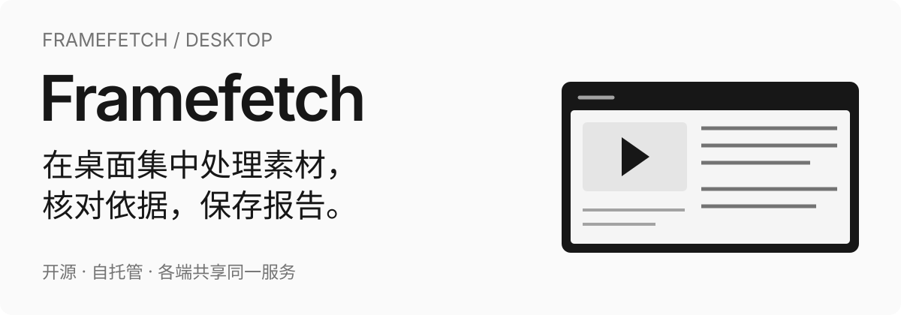

<p align="center">
  
</p>

#  帧取 · FrameFetch Desktop

**帧取工作站的独立桌面客户端。** 在电脑上集中处理视频与文档，核对分析依据，通过系统保存对话框获取文件与报告。内置共享 React 页面，连接你部署的 FrameFetch Server。

[](https://github.com/StephenQiu30/video-electron/actions/workflows/internal-build.yml)
[](LICENSE)
[](https://github.com/StephenQiu30/video-electron/releases)

[开始使用](#开始使用) · [核心功能](#核心功能) · [开发与构建](#开发与构建) · [使用范围](#使用范围) · [Server / Web](https://github.com/StephenQiu30/video-server) · [App](https://github.com/StephenQiu30/video-app) · [English](README.en.md)


> 已发布 FrameFetch Desktop 0.2.0 的真实 Electron Renderer 截图。截图与演示数据展示历史界面，不作为本轮内置 Skill 已验收的证据。

## 为什么使用帧取桌面端

在独立原生窗口中使用 Web 的业务页面。安装包内置 React 页面和资源，接口与任务更新直连你的 Server；媒体处理、存储与 AI 执行由 Server 和宿主 AI Worker 承担。

- **集中处理**：沿用 Web 布局查看视频、文档与长篇报告。
- **系统交付**：使用原生文件选择、保存对话框、菜单和窗口操作。
- **各端继续**：登录同一 Server，使用已有素材、任务和报告。

## 开始使用

### 下载公开预览版

当前公开版本为 **[v0.2.0-beta.1](https://github.com/StephenQiu30/video-electron/releases/tag/v0.2.0-beta.1)**。安装包内版本与文件名为 `0.2.0`，tag 的 `beta.1` 表示公开预览渠道。

| 系统                                | 安装包                                                                                                                                          |
| ----------------------------------- | ----------------------------------------------------------------------------------------------------------------------------------------------- |
| macOS 14.0+，Apple Silicon（ARM64） | [FrameFetch-0.2.0-mac-arm64.dmg](https://github.com/StephenQiu30/video-electron/releases/download/v0.2.0-beta.1/FrameFetch-0.2.0-mac-arm64.dmg) |
| Windows x64                         | [FrameFetch-0.2.0-win-x64.exe](https://github.com/StephenQiu30/video-electron/releases/download/v0.2.0-beta.1/FrameFetch-0.2.0-win-x64.exe)     |
| SHA-256 校验清单                    | [SHA256SUMS.txt](https://github.com/StephenQiu30/video-electron/releases/download/v0.2.0-beta.1/SHA256SUMS.txt)                                 |

安装包尚未完成发布者签名，macOS 未公证，系统可能显示安全提示；当前不提供 Intel macOS 或 Linux 安装包。下载后计算对应文件的 SHA-256，并与校验清单比较：

```sh
# macOS
shasum -a 256 FrameFetch-0.2.0-mac-arm64.dmg
```

```powershell
# Windows PowerShell
Get-FileHash .\FrameFetch-0.2.0-win-x64.exe -Algorithm SHA256
```

### 连接你的工作站

1. 准备可访问的 [FrameFetch Server](https://github.com/StephenQiu30/video-server#快速开始)，确认其登录、文件存储和所需业务能力已经配置。
2. 下载并安装目标系统的 FrameFetch 桌面包；自行构建的命令见下文。
3. 指定 Server 根地址，打开客户端并登录该 Server 的账户。默认连接 `http://127.0.0.1:8111/`，远端部署使用 HTTPS。
4. 从链接解析、本地视频或已有文档开始，或进入已有记录继续处理。

macOS 安装态指定连接地址的示例：

```sh
"/Applications/FrameFetch.app/Contents/MacOS/FrameFetch" \
  --backend-url=https://framefetch.example.com/
```

连接优先级为：`--backend-url=<地址>` → `FRAMEFETCH_BACKEND_URL` → 应用数据目录中的 `connection.json` → 默认地址。配置文件内容为：

```json
{ "backend_url": "http://127.0.0.1:8111/" }
```

地址须为无账户凭据、路径、参数或片段的根地址。远端仅接受 HTTPS，本机允许 `localhost`、`127.0.0.1` 或 `::1` 的 HTTP。`--user-data-dir=<绝对目录>` 可用于独立应用数据目录；客户端不读取浏览器已有的登录 Profile。

## 核心功能

| 能力       | 可以做什么                                                                                                                                                                 |
| ---------- | -------------------------------------------------------------------------------------------------------------------------------------------------------------------------- |
| 链接解析   | 解析有权处理的单视频、图集与有限视频合集链接；公众号文章仅做来源发现，当前候选不提供下载格式，按提示官方播放或合法文件导入。实际可用能力以 Server 的平台状态和解析结果为准 |
| 格式选择   | 核对视频尺寸、容器、视频/音频编码与帧率，选择目标规格并创建任务；图集与有限视频合集按来源能力交付带 `manifest.json` 的原图／视频 ZIP                                       |
| 本地视频   | 从系统选择 MP4，完成 SHA-256 校验与带进度的分片上传；导入完成后继续预览、管理与分析                                                                                        |
| 下载记录   | 搜索、筛选、分页、多选，批量获取文件、重试或删除；详情展示状态、进度、恢复操作与媒体预览                                                                                   |
| 内置 Skill | 原分析配置器保留 Skill、中文／英文、可编辑默认提示词和恢复默认；沿用任务状态、取消与报告操作                                                                               |
| 文档整理   | 使用已导入的完整正文，在原文档详情选择文章、公众号或小红书整理；没有标题的叙事文本也按实际源单元审阅                                                                       |
| 分析报告   | 查看 Skill 报告、原文引用、来源 SHA 和视频时间依据，使用系统保存对话框导出 Markdown / DOCX；历史报告继续只读可见                                                           |
| 平台与账户 | 查看平台接入状态，管理用户名和头像；具备 Server 管理权限的账户可访问用户、文件、平台目录、AI 线路、统计和操作日志页面                                                      |
| 亮暗主题   | 使用与 Web 一致的黑白中性色、Geist 排版和官方组件交互；保留正式 Logo 的品牌色                                                                                              |

### 专业方法与成果

当前活动目录为 6 项内置 Skill：成片审阅、素材拆解、剧本故事审稿，以及文章、公众号和小红书文档整理。具体相容类型与默认提示词来自连接的 Server。原页面布局与调用方式保持，优化集中在方法、实际取证和产出质量；实施和真实验收见 [唯一执行计划](https://github.com/StephenQiu30/video-server/blob/main/docs/plan/PLAN-内置Skill能力整合.md)。

视频审阅与拆解使用实际观察画面及定点复核，不能把抽样当作逐帧全片或声音核验。故事审稿围绕人物行动、跨单元因果和原文依据；文档整理保持完整原文并核对来源对应与覆盖。模型分析、整理和审校由 Server 的既有线路执行，结论仍需对照来源核查。

调用固定实际来源、方法和指纹，结果沿用现有分析任务与历史。MD／DOCX 从已保存结果生成，重复导出不调用模型；旧报告保留阅读用途。

### 当前界面


这些历史图片来自已发布构建在独立 Electron 会话中的真实渲染，未重绘页面。演示 API 仅提供读取响应，分析内容和剧本文字基于测试夹具，不含真实账户或私人素材。完整历史阅读视图见 [剧本阅读视图](docs/images/desktop-screenplay-reader.png)；本轮能力与验收以执行计划为准。

## 从素材到报告

1. **接入**：粘贴单条媒体链接或含单条链接的分享文案，按平台实际能力处理单视频、图集或有限视频合集；也可从系统选择 MP4，或导入 DOCX、文字型 PDF、TXT、Markdown、Fountain、SRT／VTT 文档。公众号文章仅做来源发现，当前候选不提供下载格式，按提示官方播放或合法文件导入。
2. **确认**：核对媒体信息、访问决策和真实格式，选择视频画质、容器、编码与音轨，或确认图集／合集条目和 ZIP 下载。过期解析结果可显式刷新，格式变化时重新确认。
3. **获取**：Server 后台执行下载和导入，桌面显示排队、进度与结果，提供取消、重试和历史找回。本地视频经受限分片上传后由 Worker 复验。
4. **管理**：视频提供详情、预览与文件交付；图集／有限合集以包含 `manifest.json` 的 ZIP 交付；文档保留原件与提取正文。从记录继续查看文件、历史运行和报告。
5. **处理**：在原视频／剧本文档详情选择相容 Skill、输出语言和任务要求，默认提示词可编辑或恢复。等待时查询状态或取消，回执未知时先核对已有任务。
6. **交付**：结合原文引用、时间依据和限制阅读结果，通过系统保存窗口获取 MD／DOCX。再次导出复用已保存报告。

耗时任务由 Server 的 Worker 和宿主 AI Worker 执行。桌面接收任务状态更新；连接同一服务并登录同一账户后，可以从 Web、桌面或 App 继续查看业务记录。文本按真实场景、章节或无标题单元审阅，视频按实际观察位置引用。来源对应与覆盖帮助核查，不证明分析结论正确或完整声音理解。执行设计见 [Server AI 分析](https://github.com/StephenQiu30/video-server/blob/main/docs/design/10-AI分析.md)。

## 三个项目，一套产品

| 项目                                                                    | 负责什么                                                                                                   |
| ----------------------------------------------------------------------- | ---------------------------------------------------------------------------------------------------------- |
| [FrameFetch Server / Web](https://github.com/StephenQiu30/video-server) | FastAPI 业务接口、Next.js Web 页面、用户与权限、解析/下载/导入/分析、队列与 Worker、数据库、对象存储和报告 |
| **FrameFetch Desktop，本仓库**                                          | 独立 Electron 安装包，内置共享 React 页面，连接现有 Server，提供窗口、会话与受限原生能力                   |
| [FrameFetch App](https://github.com/StephenQiu30/video-app)             | Flutter iOS/Android 原生客户端，通过同一 Server 契约提供移动端文件导入、播放、分析、报告与管理入口         |

桌面运行时，Electron 使用配置的 Server origin，在独立 Chromium 会话中从安装包返回 HTML、JS、字体和图片。`/api`、`/health` 请求连接已有 Server，WebSocket 沿用同源会话协议。页面随客户端安装，不依赖远端 Frontend 页面或本机 Frontend 进程。

原件、规范化文本、任务与报告保存在 Server 配置的存储中。桌面本地保存连接偏好与独立 Chromium 会话，按 Server 地址隔离登录状态；安装包提供界面，业务操作需要 Server 可达。桌面不运行离线媒体引擎、离线 AI 模型或独立业务数据库。

<details>
<summary>技术如何支持体验</summary>

### 技术如何支持体验

| 技术                                             | 产品中的职责                                             |
| ------------------------------------------------ | -------------------------------------------------------- |
| Electron / Chromium                              | 原生窗口、系统保存文件、原生菜单、独立会话和桌面生命周期 |
| React / TypeScript strict / Vite                 | 复用实际 Frontend 页面，将页面与资源编译进安装包         |
| Tailwind CSS / shadcn / Radix / Phosphor / Geist | 保持多端品牌、视觉层级、键盘与焦点交互一致               |
| Axios / TanStack Query                           | 统一请求、缓存、状态刷新、取消与会话失效处理             |
| FastAPI OpenAPI / @umijs/openapi                 | 与 Web 使用同一份自动生成接口和类型，保持业务契约一致    |
| WebSocket / HTTP 文件流                          | 任务实时更新、断线恢复，以及带 HEAD/Range 语义的文件访问 |
| SHA-256 / 分片上传                               | 文件完整性校验、进度反馈与 Server 签发的受限上传入口     |
| electron-builder                                 | macOS DMG 与 Windows NSIS 安装包                         |

</details>

## 使用范围

- 只处理已获授权的 HTTP(S) 非 DRM 素材。平台、身份与网络条件会影响实际可用性，准确状态和完整文件证据以 [Server 平台目录与验证边界](https://github.com/StephenQiu30/video-server/blob/main/docs/design/17-解析引擎重建.md#8-平台能力与验证边界) 为准。
- 部署者提供服务、存储、网络和模型；外部模型可能产生费用，并接收分析所需的文本或画面。
- 当前产品覆盖素材获取、管理、内置分析与文档整理、报告交付。内容写作、剪辑、作品与母稿管理、版本确认、图卡、ASR／OCR、DRM 解密、直播录制、无限播放列表、在线协作编辑和自动平台发布不在本轮范围内。

## 开发与构建

Node.js 要求 `>=24.15.0 <25`，pnpm 为 `12.4.2`。准确版本以 [package.json](package.json) 和唯一锁文件为准。

```sh
pnpm install --frozen-lockfile
pnpm dev
```

连接已有远端 Server：

```sh
FRAMEFETCH_BACKEND_URL=https://framefetch.example.com/ pnpm dev
```

运行已有构建：

```sh
pnpm build
pnpm start
```

在目标系统构建安装包：

```sh
pnpm build
# Apple Silicon macOS
pnpm exec electron-builder --mac --arm64 --publish never
# Intel macOS
pnpm exec electron-builder --mac --x64 --publish never
# Windows x64
pnpm exec electron-builder --win --x64 --publish never
```

产物位于 `release/`；当前 macOS 构建配置最低版本为 macOS 14.0。默认构建配置生成内部未签名安装包，外部分发时的签名、公证和目标系统安装验证见 [构建资源](resources/README.md)。

### 页面与接口同步

`video-server/frontend` 是业务页面、文案、品牌和主题的来源。[design.md](design.md) 保留 Server 视觉规范的原文快照。上游文件由同步脚本管理，仅平台 adapters 手工维护。

在具有相邻 Server 源码的工作区更新并检查：

```sh
pnpm frontend:sync
pnpm frontend:check
pnpm frontend:check-upstream
```

`frontend:check` 离线检查已提交快照与 manifest hash，可用于独立 checkout 和 CI；`frontend:check-upstream` 对照选定上游 checkout 的实际内容。安装和运行不需要相邻源码，其他 checkout 的同步方式见 [源码复用说明](resources/FRONTEND_BASELINE.md)。

接口变更先在 Server Frontend 执行 OpenAPI 生成，再同步到桌面。需要对照其他当前契约时：

```sh
OPENAPI_SCHEMA_URL=http://127.0.0.1:8111/openapi.json pnpm openapi:check
```

契约链路为 FastAPI 注解/Pydantic → `/openapi.json` → Swagger `/docs` → `@umijs/openapi`。数据库结构唯一来源是 Server 的 `backend/sql/schema.sql`；不手工修改生成 API，不复制维护桌面 SQL、DTO 或 Swagger 文档。

### 检查

```sh
pnpm frontend:check
pnpm lint
pnpm typecheck
pnpm test
pnpm build
pnpm test:e2e
pnpm package:dir
```

本地包验收使用独立会话目录，连接真实 Server，并在安装包中验证登录、现有来源直接调用 Skill、任务查询／取消、报告阅读、系统保存文件和重启恢复：

```sh
"release/mac-arm64/FrameFetch.app/Contents/MacOS/FrameFetch" \
  --backend-url=http://127.0.0.1:8111/ \
  --user-data-dir=/tmp/framefetch-desktop-qa/user-data
```

单元测试和模拟接口的桌面冒烟检查不能替代上述业务验收。当前本地 ARM64 包验收也不代表 Windows 安装、签名或公证已完成。

检查分别覆盖源码一致性、格式和类型、单元测试、生产构建、真实 Electron 传输及安装包。真实 Server 用户流程和各目标系统安装行为按 [验收边界](docs/design/01-验收边界.md) 单独验证。

`v0.2.0-beta.1` 安装包来自提交 `c8a85c94548a20619bf8b34a71a6916992654a17` 的 [成功 CI](https://github.com/StephenQiu30/video-electron/actions/runs/37096373778)。macOS ARM64 与 Windows x64 的单元测试、开发态及打包态传输 E2E 通过，E2E 使用受控夹具，只证明相应传输行为，不等于真实 Server 全业务验收。干净安装、升级、卸载和真实 Server 完整业务流程仍需独立验证。

## 文档与贡献

- [工程规范](PROJECT.md)：技术、目录职责、接口和连接边界。
- [设计文档](docs/design/README.md)：当前架构与验收条件。
- [源码复用](resources/FRONTEND_BASELINE.md)：页面依赖闭包、来源 hash 与同步方法。
- [资源说明](resources/README.md)：图标、字体、依赖许可、构建与签名。
- [贡献指南](CONTRIBUTING.md) · [问题反馈](https://github.com/StephenQiu30/video-electron/issues) · [安全报告](SECURITY.md)。

业务操作沿用 Server 的身份、所有者权限和平台能力，请仅处理已获授权内容。历史版本的本地媒体、数据库、报告和凭据文件保留原件，不自动上传、导入 Server 或删除。

源码采用 [MIT 许可](LICENSE)。依赖、字体和品牌资源保留各自适用许可。

如果帧取有助于你的创作、研究或自托管工作，欢迎 **Star** 本仓库、关注 [Releases](https://github.com/StephenQiu30/video-electron/releases)，或从 `good first issue`／`help wanted` 的 [Issues](https://github.com/StephenQiu30/video-electron/issues) 开始贡献。
