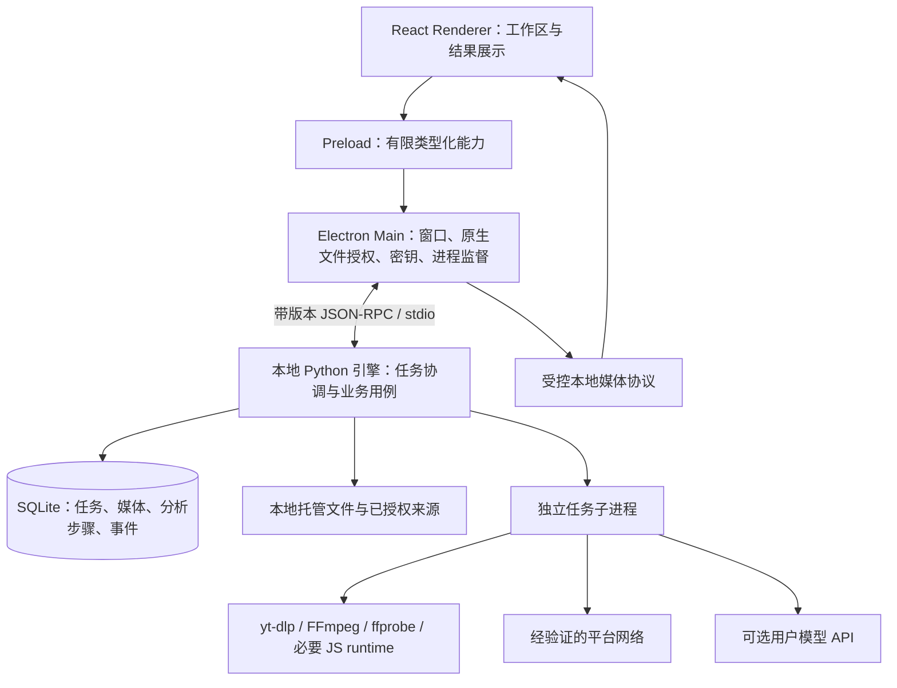

# 本地架构与复用边界

## 1. 方案比较与选择

| 方案 | 收益 | 工作与限制 | 结论 |
| --- | --- | --- | --- |
| Electron + React + 随包 Python 引擎 | 复用现有 Python 视频规则、Skill 与 React 展示；本地执行；不需要部署服务 | 需要桌面存储、协议、跨平台进程与冻结适配 | 推荐 |
| Electron + 本地完整 FastAPI/Next 服务 | 初期更接近现有页面/API | 仍需移除 PG/MQ/Temporal/MinIO；本地端口、会话、多个服务生命周期增加复杂度 | 不作为首版主架构 |
| Electron + 全 Node 视频业务重写 | 单一语言开发面；可调用 yt-dlp/FFmpeg | Python 平台规则、验证、AI/文档处理需大量重写；重验收成本高 | 不优先 |

完整服务端装进 Docker 并随桌面分发不能满足轻量安装和无需部署的目标。Tauri/Flutter Desktop 不作为本轮框架替换选项，采用用户要求的 Electron。

## 2. 推荐进程结构



Renderer 不取得 Node、Shell、完整文件系统或凭据读取能力。Main 不运行 ffprobe、抽帧、哈希或重型文档处理；仅授权、监督、转发与处理原生交互。

Python 引擎是 SQLite 和业务状态的唯一所有者，协调持久队列、文件发布与任务恢复。耗时/不可信媒体处理交给子进程，子进程只取得本次任务需要的文件与临时凭据，不直接写业务数据库。Python coordinator 的事件循环不能被媒体任务阻塞。

默认不启动 HTTP API、Next.js 或 WebSocket 业务服务。主进程通过 `child_process.spawn` 启动冻结引擎；Electron `utilityProcess.fork` 是 Node.js 进程 API，不能用作 Python 执行器，见 [Electron utilityProcess](https://www.electronjs.org/docs/latest/api/utility-process)。

## 3. 技术栈建议

| 层 | 选型 | 原因与约束 |
| --- | --- | --- |
| 桌面壳 | Electron + TypeScript strict | 窗口、原生文件、系统通知、跨平台安装 |
| 构建 | electron-vite + pnpm | 分开构建 main/preload/renderer；版本和锁文件固定 |
| 分发 | electron-builder | DMG、完整 NSIS；后续 electron-updater |
| UI | React + Tailwind + shadcn/Radix + Phosphor | 从现有 Web 移植纯控件和展示组件 |
| 导航 | React Router 内存路由 | 桌面业务路由不依赖 Web URL 或 Next runtime |
| Renderer 数据 | TanStack Query + 组件状态 | 通过 preload 读事实与执行命令，不在 Renderer 建第二份持久任务账本 |
| 本地引擎 | Python + uv + Pydantic，PyInstaller onedir | 复用业务规则和分析契约；系统无需安装 Python |
| 本地数据库 | Python stdlib sqlite3 + 显式 SQL 迁移 | 避免 Node 原生 SQLite 模块 ABI；不照搬服务端 PG ORM |
| 媒体处理 | 固定 yt-dlp 制品、可信插件、FFmpeg/ffprobe | 使用受控参数与真实资源路径；不接受任意下载器命令 |
| 解析辅助 | 按平台固定 yt-dlp-ejs 与独立 JS runtime | 不假定 Electron 内部 Node 可被下载器直接使用 |
| AI | 精简 Provider adapter + 迁移的结果 schema/Skill | 默认 BYOK API；不内置 CLI OAuth 或模型权重 |
| 凭据 | Main 封装 Electron safeStorage | 能力不足时只允许当前会话内存保存，不降级明文落盘 |
| Windows进程监督 | 最小原生Job Object适配 | Main持有kill-on-close句柄；引擎入job后才允许启动子树，P0验证原生模块 |
| 质量 | TS 检查、Vitest、Electron E2E；Ruff、mypy、pytest | 单元测试与安装包真实验收分开 |

精确版本在 P0 用兼容验证后的版本固定到 `package.json`、`pnpm-lock.yaml`、`pyproject.toml` 和 `uv.lock`。不把“latest”作为可复现构建配置。[electron-vite 分发说明](https://electron-vite.org/guide/distribution)直接支持 builder；[Forge Vite 插件](https://www.electronforge.io/config/plugins/vite)当前标为 experimental，Forge 作为替代候选即可。

## 4. 现有项目的事实与复用

以下路径是本次检查的源码来源，并非桌面运行时依赖。

| 来源 | 已确认情况 | 桌面处理 |
| --- | --- | --- |
| `video-server/frontend/src/app/layout.tsx`、`src/lib/server-session.ts` | 服务端读取 Cookie 并请求会话 | 重写本地启动，不搬登录系统 |
| `frontend/next.config.ts`、`src/proxy.ts`、`src/app/storage-upload/route.ts` | Next standalone、后端代理、MinIO 上传代理 | 不可直接 static export；新建 React Renderer |
| `frontend/src/lib/request.ts`、`src/lib/task-socket.ts` | Web Cookie、同源 REST、WebSocket | 换为 preload/IPC；保留事件后读取持久事实和防旧响应覆盖的规则 |
| `frontend/src/components/ui/` | React/Radix 基础组件 | 移植源码、样式及依赖；保留焦点、错误、键盘语义 |
| `components/intake/format-picker.tsx` | 数据和回调驱动的格式展示 | 移植 UI，改用桌面契约 |
| `components/analysis/analysis-scene-list.tsx`、`analysis-structured-report-view.tsx` | 结构化报告与时间跳转展示 | 移植展示与交互 |
| `components/analysis/analysis-report-preview.tsx` | Markdown 标签限制和 HTML 禁用 | 保留安全渲染边界；导出改为原生保存 |
| `components/downloads/download-video-preview.tsx` | Vidstack 和 Web 文件源 | 复用控件，文件源改为受控本地协议；编码重新验收 |
| `video-app/lib/core/config/app_config.dart`、`features/media/data/media_repository.dart` | 配置服务端地址，获取远程授权媒体 URL | 复用产品流程、文案和验收语义，不复用 Dart runtime |
| `backend/app/core/composition.py` | 组装 PG、Redis、RabbitMQ、MinIO 等 | 不随桌面搬迁 |
| `backend/app/workers/analysis/main.py` | 依赖 PG、MinIO、Temporal | 迁移分析用例与步骤语义，重写执行装配 |
| `backend/app/services/analysis/skills/`、分析结果校验 | 内置 Skill、报告契约、时间证据验证 | 精选迁移，保留来源和许可证，不加载任意用户代码 |
| 媒体规则、规格选择、文件完整性校验、文档提取与 DOCX 渲染 | 有可复用业务逻辑，但调用依赖需逐项拆开 | 优先提取纯逻辑；存储和执行通过桌面适配器替换 |

本次服务端设计 17 仍记录部分平台与身份负例、全矩阵未完成；例如视频号尚未恢复，Dailymotion 的 HTTP403 不代表保护内容。桌面不能将服务端“已接线”状态变成平台支持承诺。

## 5. 需要重写的基础设施

| 服务端机制 | 桌面实现 |
| --- | --- |
| PostgreSQL + ORM + owner/quota | 单用户 SQLite schema 与本地资源上限 |
| Redis auth/session/rate limit | 本地非敏感配置、内存限流、持久任务限额 |
| RabbitMQ / Temporal / Outbox | SQLite 事务持久队列 + 单执行所有者 + 步骤日志；不部署消息服务 |
| MinIO + upload session + signed URL | 本地文件授权、流式复制、索引和受控媒体协议 |
| API 用户/管理员/部署状态 | 当前设备设置与能力诊断 |
| Container Runner / egress-proxy | 原生任务子进程和受控网络适配；重验重定向、DNS、代理边界 |
| 宿主 CLI AI Worker | 内置 API Provider adapter；CLI OAuth 后置 |

服务端 SQL 使用 PostgreSQL dialect、锁/lease、事务 Outbox 和配额模型，不能只替换数据库连接串。桌面需要自己的简洁数据模型与恢复语义。

## 6. 已识别的跨平台阻塞

- `workers/runner/browser_runtime.py` 使用 `fcntl`、Linux UA、`os.getuid` 和 tmpfs 校验；Windows 不能直接运行。
- Runner settings 的 `/var/lib`、容器出口代理与宿主桥接地址必须替换为 `DesktopSettings`。
- 身份扩展安装涉及 Git 主工作区、POSIX 文件权限和现有 launchd/.venv 路径，不能要求用户保留服务端源码。
- `commands.py` 使用 `sys.executable -m ...` 与 `xvfb-run`；冻结后 `sys.executable` 指向引擎程序，应改为明确的引擎子命令入口或专用辅助可执行文件。
- 服务端 Dockerfile 安装 Node、Playwright Chromium 和 Xvfb，这些不会自动出现在桌面包里。首版不包含完整浏览器阶梯；需要它的候选平台不通过时不得发布为可用。
- Windows 终止进程树、文件锁、路径与 ACL 需要原生适配；macOS 的已签名可执行文件、Keychain 和隔离标记需要安装态验证。

## 7. 目标源码结构

以下为 P1 后逐步形成的目标结构，当前不创建空代码目录：

```text
video-electron/
  README.md
  package.json / pnpm-lock.yaml
  electron.vite.config.ts
  electron-builder.yml
  src/
    main/                 # 窗口、IPC、授权、credentials、engine supervisor、media protocol
    preload/              # 明确能力接口与事件订阅
    renderer/
      app/                # 装配、内存路由、主题
      features/           # intake、tasks、library、documents、analysis、settings
      components/ui/      # 移植后的基础控件
    shared/               # 协议生成类型、有限平台常量；无通用万能工具层
  engine/
    pyproject.toml / uv.lock
    src/framefetch_desktop/
      __main__.py         # coordinator 与 task-worker 子命令
      protocol/           # Pydantic 请求、结果、事件、协议生成
      tasks/              # 调度、取消、恢复、分析步骤
      media/              # inspect、download、probe、verify、frames
      documents/          # 提取、规范化、报告导出
      analysis/           # Provider、Skill、结果验证
      storage/            # SQLite、SQL迁移、asset发布
      platform/           # OS进程、文件权限、网络与资源路径适配
    resources/skills/
    tests/
  resources/              # 图标、打包说明、第三方 notices；二进制由构建流程获取
  scripts/                # 固定资源获取、schema生成、冻结、资源manifest和打包
  tests/                  # IPC与安装态E2E
  docs/design/
  .github/workflows/      # 后续独立仓库的质量与发布工作流
```

桌面构建不通过相对路径引用 sibling 仓库。第一期将经过评估的少量源码复制进入本项目，记录来源 commit、许可证和已有测试的迁移范围；后续通过评审同步规则修复。只有出现稳定、重复的双项目维护需求时，才独立发布共享包；不为复用率建立大规模通用框架。
